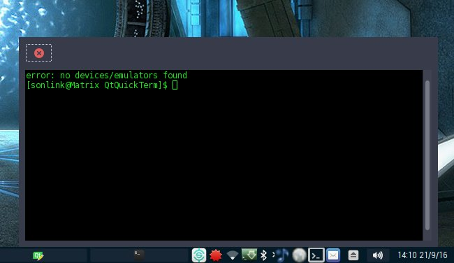

# QtQuickTerm

(c) 2016 Alfonso Saavedra "Son Link"

**QtQuickTerm** is a minimal terminal. Simply click in the system tray icon and show or hide the terminal

## Requisites:
* Python 3
* PyQt5
* [qtermwidget](https://github.com/lxde/qtermwidget)
* Qterminal (required for compile qterwidget)
* [pyqtconfig](https://github.com/mjirik/pyqtconfig) (required for compile qtermwidget PyQt lib)

## How to use:
* Click on the system tray icon for show/hide the terminal
* Right click on the system tray icon for show the menu
* Right click on the window show the menu

Under GNU/GPL 3 license